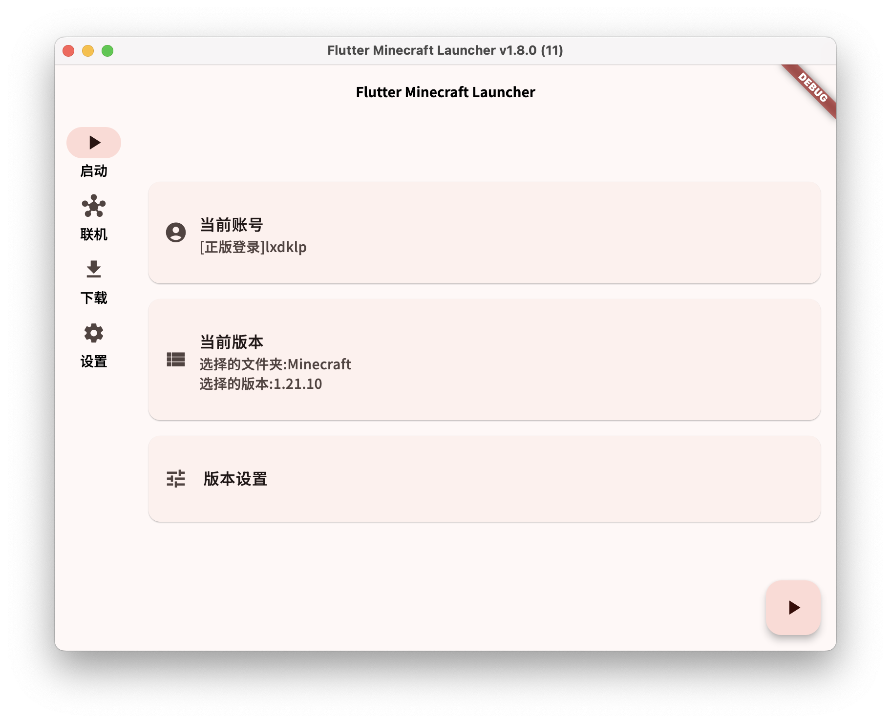

   

   

 

# Flutter Minecraft Launcher

一个由Flutter编写的Material Design 3风格的使用GPL3.0协议开源跨平台Vanilla/Fabric/NeoForge Minecraft Java启动器,支持Windows、macOS、Linux

# 截屏

# 安装

[GitHub Releases](https://github.com/lxdklp/FML/releases/latest)

# 贡献

详见 [CONTRIBUTING.md](CONTRIBUTING.md)

###### Flutter logo : [Sawaratsuki](https://github.com/SAWARATSUKI)